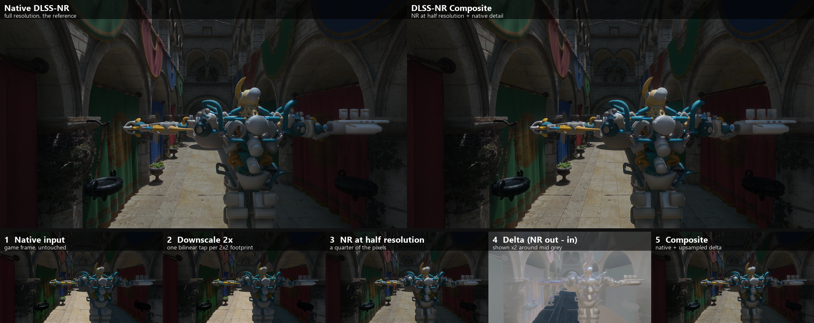
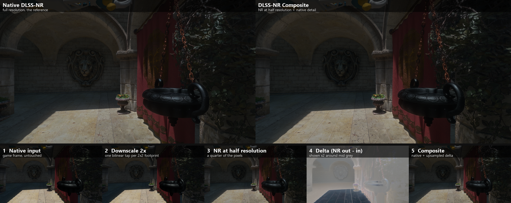

# DLSS-NR Composite

Runs DLSS Neural Rendering at half resolution and writes

    output = native + bilinear_up(NR_output - NR_input)

The NR network evaluates a quarter of the pixels; only its edit is upscaled,
the native frame stays untouched.

## Install

DirectX 12 game with DLSS-NR. Pick one:

- **ReShade** (addon support build): copy `dlssnr_composite.addon64` next to the
  ReShade DLL. The overlay page "DLSS-NR Composite" has an on/off
  toggle (off = the game's own native NR) and lists the intercepted features.
- **ASI loader**: copy `dlssnr_composite.asi` where the loader looks.
- **Any injector**: load `dlssnr_composite.dll`.

Without ReShade the mod is always on and has no UI. All three files are the
same binary. Log: `dlssnr_composite.log` beside the DLL.

## Build

    git clone --recursive <this repo>
    cmake -S . -B build -A x64
    cmake --build build --config Release

Needs Visual Studio and the Windows SDK (its `fxc.exe` compiles the shaders at build time). Output in
`build/bin/Release/`.

## How

Hooks `NVSDK_NGX_D3D12_CreateFeature` / `EvaluateFeature` / `ReleaseFeature`
in every NGX module of the process (MinHook). Feature 18 created at native
size with scaling ratio 1 becomes a half-size real feature. Per evaluation,
two compute dispatches around the real feature: `Reduce` (one bilinear tap per
2x2 footprint for colour, motion vectors and depth) and `Compose`
(native + bilinear upsample of the reduced delta into the game's output).

Sponza, animation frozen: native DLSS-NR against the composite, and the
stages (native input, 2x downscale, NR at half resolution, delta, composite).

